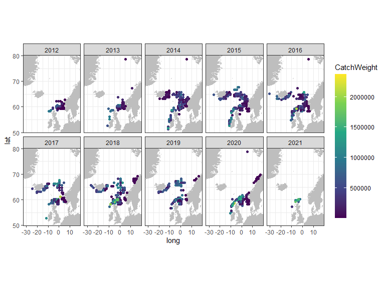

taggart
================

This package is a wrapper for downloading tagging data for mackerel
using the API of [Norwegian Marine Data Centre](https://nmdc.no/nmdc).
Any use of the data on mackerel should give reference to [Slotte et al
(2021)](#ref1). The package is planned to be extended with tagging data
for Norwegian spring spawning herring, but this is a work in progress.

The taggart package was originally developed by Einar Hjorleifsson, but
Sondre Hølleland has taken over the maintenance and further development
of the package.

## Authors’ github accounts

**Einar Hjorleifsson** -
[einarhjorleifsson](https://github.com/einarhjorleifsson)

**Sondre Hølleland** - [holleland](https://github.com/holleland)

## <a name="ref1"></a>Data reference

Aril Slotte (IMR), Anna Ólafsdóttir (MFRI), Sigurður Þór Jónsson (MFRI),
Jan Arge Jacobsen (FAMRI) and Steve Mackinson (SPFA) (2021) PIT-tag time
series for studying migrations and use in stock assessment of North East
Atlantic mackerel (Scomber Scombrus)
<http://metadata.nmdc.no/metadata-api/landingpage/f9e8b1cff4261cf6575e70e56c4c3b3e>

## License

This project is licensed under the GNU GPLv3 License - see
[LICENSE](LICENSE.md). The data is licensed under Creative Commons [CC
BY 4.0](https://creativecommons.org/licenses/by/4.0/) license (see
[Slotte et al (2021)](#ref1)).

## Example code

To install the package, run the following code:

``` r
devtools::install_github("IMRpelagic/taggart", dependencies = FALSE)
```

Load library:

``` r
library(taggart)
```

Get the data and have a peek

``` r
tg_catches() %>% glimpse()
#> Rows: 8,091
#> Columns: 19
#> $ CatchID               <chr> "2106ae1b-ea13-4b84-b8f6-0523776a9ffa", "7584...
#> $ CatchNo               <int> 268, 553, 253, 1254, 1508, 872490, 539, 1475,...
#> $ Nation                <chr> "IS", "IS", "IS", "IS", "IS", "IS", "IS", "IS...
#> $ CatchDate             <chr> "2019-08-31T00:00:00", "2018-09-12T00:00:00",...
#> $ ICES_Rectangle        <chr> "62F0", "58F0", "63E7", "58D9", "58D7", "57D7...
#> $ ICES_Area             <chr> "IIa1", "IIa", "IIa1", "Va2", "Va2", "Va2", "...
#> $ Factory               <chr> "IC02 Neskaupstad", "IC02 Neskaupstad", "IC02...
#> $ FactoryICES_Rectangle <chr> "59D6", "59D6", "59D6", "59D6", "59D6", "59D6...
#> $ ProcessingDate        <dttm> 2019-08-31 23:59:00, 2018-09-12 23:59:00, 20...
#> $ CatchWeight           <dbl> 1153803, 698377, 893406, 356403, 482060, 5473...
#> $ AvgFishWeight         <dbl> 0.4710, 0.4300, 0.4550, 0.4230, 0.4260, 0.484...
#> $ BioSample             <chr> "CatchBiologyIS-Aug2019-AreaIIa", "CatchBiolo...
#> $ FactoryID             <chr> "758459f7-a4f4-43e8-830e-06c270d2da84", "7584...
#> $ BioSampleID           <chr> "26ce9b70-2e26-4448-987d-e704c8f15c1f", "3dd4...
#> $ cLon                  <dbl> 0.5, 0.5, -2.5, -10.5, -12.5, -12.5, -12.5, -...
#> $ cLat                  <dbl> 66.75, 64.75, 67.25, 64.75, 64.75, 64.25, 64....
#> $ pLon                  <dbl> -13.5, -13.5, -13.5, -13.5, -13.5, -13.5, -13...
#> $ pLat                  <dbl> 65.25, 65.25, 65.25, 65.25, 65.25, 65.25, 65....
#> $ species               <chr> "mackerel", "mackerel", "mackerel", "mackerel...
tg_catches_bio() %>% glimpse()
#> Rows: 35,599
#> Columns: 18
#> $ IndividualFishID <chr> "5a96ebe8-6394-4cb3-815a-0000c46a9144", "0661f4ef-...
#> $ StationNo        <chr> "8089", "8018", "35", "8093", "16", "50", "58", "3...
#> $ SampleNo         <chr> "38089", "38018", "38035", "38093", "38016", "3805...
#> $ Nation           <chr> "74", "58", "58", "74", "45", "58", "58", "58", "F...
#> $ CatchGear        <chr> "3500", "3712", "3712", "3500", "16.02.1910", "16....
#> $ CatchDate        <dttm> 2015-10-29, 2014-09-16, 2019-10-13, 2015-10-25, 2...
#> $ Longitude        <dbl> -1.5000000, 1.0166667, -1.5000000, -1.5000000, -6....
#> $ Latitude         <dbl> 60.25000, 63.60000, 59.25000, 60.25000, 59.25000, ...
#> $ ICES_Rectangle   <chr> "49E8", "56F1", "47E8", "49E8", "47E3", "48E9", "4...
#> $ ICES_Area        <chr> "IVa", "IIa2", "IVa", "IVa", "VIa", "IVa", "IVa", ...
#> $ FishNo           <chr> "28", "10", "4", "20", "5", "5", "1", "6", "46", "...
#> $ Weight           <dbl> 0.4920, 0.3730, 0.3060, 0.3100, 0.3890, 0.3640, 0....
#> $ Length           <dbl> 0.38, 0.36, 0.32, 0.33, 0.37, 0.34, 0.40, 0.36, 0....
#> $ sex              <int> 1, 2, 2, 1, 1, 1, 2, 2, 1, 1, 1, 1, 1, 1, 1, 2, 2,...
#> $ Maturity         <int> 3, 8, 8, 8, 3, 8, 8, 8, 8, 2, 4, 8, 8, 6, 8, 6, 8,...
#> $ Age              <int> 8, 5, 3, 5, 7, 4, 12, 7, 4, 1, 11, 9, 8, 5, 2, 5, ...
#> $ YearClass        <int> 2007, 2009, 2016, 2010, 2011, 2014, 2007, 2010, 20...
#> $ Species          <chr> "mackerel", "mackerel", "mackerel", "mackerel", "m...
tg_catches_link() %>% glimpse()
#> Rows: 41,308
#> Columns: 2
#> $ BioSampleID      <chr> "2a57fb1b-300e-48ee-b27d-03e4fe1c99fd", "2a57fb1b-...
#> $ IndividualFishID <chr> "ee6dd054-9274-4ee3-b564-00f233cc941e", "437eaf99-...
tg_expeditions() %>% glimpse()
#> Rows: 457,292
#> Columns: 19
#> $ Expedition     <chr> "2011808", "2019839", "2016832", "2020816", "2018828...
#> $ ExperimentNo   <chr> "7", "76", "53", "84", "1070", "16", "62", "79", "11...
#> $ ReleaseNo      <chr> "3", "4", "1", "8", "4", "4", "2", "7", "2", "4", "6...
#> $ ReleaseDate    <dttm> 2011-05-28 21:35:54, 2019-05-10 08:38:34, 2016-05-2...
#> $ ReleaseBirds   <chr> NA, "Lots", "Medium", "Lots", "Medium", NA, "None", ...
#> $ ReleaseWaves   <chr> NA, "None", "Medium", "Lots", "None", NA, "None", "M...
#> $ ICES_Rectangle <chr> "32D7", "38D9", "32D9", "48E4", "32D8", "34D8", "38E...
#> $ Tagger         <chr> "JHN", "EH", "JR", "MK", "JR", "JR", "JR", "OS", "JR...
#> $ Assistant      <chr> NA, "FB", "FB", "EH", "FA", NA, "FB", "SK", NA, "ALJ...
#> $ RFID           <chr> "900196000062514", "900153000105720", "9001960002960...
#> $ Length         <dbl> 35, 34, 35, 35, 36, 34, 37, 38, 27, 36, 34, 36, 25, ...
#> $ Longitude      <dbl> -12.271990, -10.250000, -10.811360, -5.050000, -11.4...
#> $ Latitude       <dbl> 51.96140, 54.77000, 51.75225, 59.95000, 51.95000, 52...
#> $ RecaptureDate  <dttm> NA, NA, NA, NA, NA, NA, NA, NA, NA, NA, NA, NA, NA,...
#> $ CatchID        <chr> NA, NA, NA, NA, NA, NA, NA, NA, NA, NA, NA, NA, NA, ...
#> $ FactoryID      <chr> NA, NA, NA, NA, NA, NA, NA, NA, NA, NA, NA, NA, NA, ...
#> $ BioSample      <chr> "ReleaseSample2011-May", "ReleaseSample2019", "Relea...
#> $ BioSampleID    <chr> "9ceb259a-512c-4c00-bea5-cf5b320b2700", "e0d58869-c1...
#> $ species        <chr> "mackerel", "mackerel", "mackerel", "mackerel", "mac...
tg_expeditions_bio() %>% glimpse()
#> Rows: 6,668
#> Columns: 18
#> $ IndividualFishID <chr> "304588b2-837d-419c-8953-0001097bf418", "2208bc71-...
#> $ StationNo        <chr> "MMGE2-2017", "6", "7", "27", "75", "MAKR-2019-46"...
#> $ SampleNo         <chr> "2", "37356", "37207", "37527", "86225", "501121",...
#> $ Nation           <chr> "ICE", "58", "58", "NO", "58", "IS", "58", "58", "...
#> $ CatchGear        <chr> "3", "1", "5211", "5211", "3712", "7", "5211", "52...
#> $ CatchDate        <dttm> 2017-08-17, 2017-05-11, 2012-05-16, 2015-06-03, 2...
#> $ Longitude        <dbl> -23.916667, -10.366667, -12.016667, -9.350000, 1.3...
#> $ Latitude         <dbl> 64.73333, 54.78333, 52.96667, 56.16667, 60.43167, ...
#> $ ICES_Rectangle   <chr> "58C6", "38D9", "34D7", "41E0", "49F1", "57C5", "3...
#> $ ICES_Area        <chr> "Va2", "VIIb", "VIIc", "VIa", "IVa", "Va2", "VIIk2...
#> $ FishNo           <chr> "8", "17", "47", "17", "11", "5", "14", "34", "12"...
#> $ Weight           <dbl> 0.6666, 0.3310, 0.4340, 0.2810, 0.3580, 0.5010, 0....
#> $ Length           <dbl> 0.40, 0.36, 0.39, 0.31, 0.33, 0.37, 0.37, 0.41, 0....
#> $ sex              <int> 2, 2, 1, 1, 2, 1, 2, 1, 2, 1, 1, 2, 1, 1, 2, 1, 1,...
#> $ Maturity         <int> 6, 8, 6, 6, 8, 6, 6, 7, 8, 6, 6, 6, 6, 7, 8, 6, 5,...
#> $ Age              <int> 10, 6, 10, 3, 4, 7, 8, 11, 6, 3, 11, 11, 6, 9, 6, ...
#> $ YearClass        <int> 2007, 2011, 2002, 2012, 2007, 2012, 2010, 2007, 20...
#> $ species          <chr> "mackerel", "mackerel", "mackerel", "mackerel", "m...
tg_expeditions_link() %>% glimpse()
#> Rows: 8,030
#> Columns: 2
#> $ BioSampleID      <chr> "86e3d69b-24f3-44f5-a0a1-008510987f44", "86e3d69b-...
#> $ IndividualFishID <chr> "2fb3eeb8-7c34-4482-aec0-00915374b438", "17e45eab-...
tg_outoforder() %>% glimpse()
#> Rows: 9
#> Columns: 4
#> $ Reason    <chr> "Noise issues", "Noise issues", "Noise issues", "Noise is...
#> $ FactoryID <chr> "d1387244-62db-4f97-aae3-cd8c153a8612", "e6daec23-0122-43...
#> $ start     <chr> "2018-01-01T00:00:00", "2018-01-01T00:00:00", "2014-01-01...
#> $ end       <chr> "2018-12-31T00:00:00", "2019-12-31T00:00:00", "2017-12-31...
```

## Plot map of recaptures

As an example, we can download the catch data using the API and create a
plot of the catches by year.

``` r
library(ggplot2)
library(lubridate)
# Download the data
d <- tg_catches()

# Calculate range of longitudes and latitudes
xlim = range(d$cLon)
ylim = range(d$cLat)
# Get map: 
m <- ggplot2::map_data("world",
                       xlim = xlim * c(0.9, 1.1),
                       ylim = ylim * c(0.9, 1.1))
# Create plot: 
ggplot() +
  geom_polygon(data = m, aes(long, lat, group = group), fill = "grey") +
  geom_point(data = d, aes(cLon, cLat, col = CatchWeight)) +
  coord_quickmap(xlim = xlim, ylim = ylim) +
  facet_wrap( ~year(CatchDate), ncol = 5) +
  theme_bw()+
  guides(color = guide_colorbar(barheight = 15))+
  scale_color_viridis_c()
```


