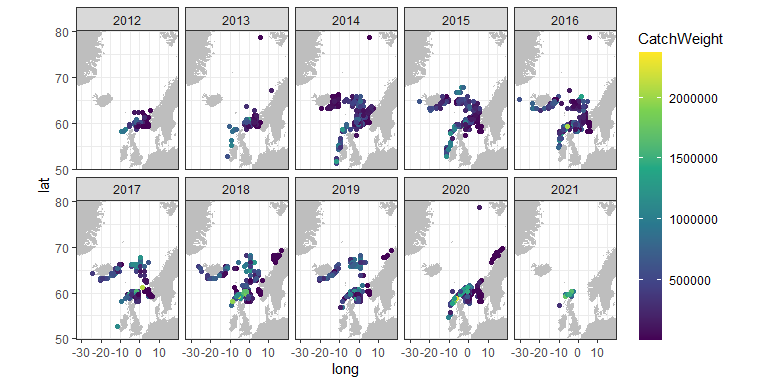

taggart
================

This package is a wrapper for downloading tagging data for mackerel
using the API of [Norwegian Marine Data Centre](https://nmdc.no/nmdc).
Any use of the data on mackerel should give reference to [Slotte et al
(2021)](#ref1). The package is planned to be extended with tagging data
for Norwegian spring spawning herring, but this is a work in progress.

The taggart package was originally developed by Einar Hjörleifsson, but
Sondre Hølleland has taken over the maintenance and further development
of the package.

## Authors’ github accounts

**Einar Hjörleifsson** -
[einarhjorleifsson](https://github.com/einarhjorleifsson)

**Sondre Hølleland** - [holleland](https://github.com/holleland)

## <a name="ref1"></a>Data reference

Aril Slotte (IMR), Anna Ólafsdóttir (MFRI), Sigurður Þór Jónsson (MFRI),
Jan Arge Jacobsen (FAMRI) and Steve Mackinson (SPFA) (2021) PIT-tag time
series for studying migrations and use in stock assessment of North East
Atlantic mackerel (Scomber Scombrus)
<http://metadata.nmdc.no/metadata-api/landingpage/f9e8b1cff4261cf6575e70e56c4c3b3e>

## License

This project is licensed under the GNU GPLv3 License - see
[LICENSE](LICENSE.md). The data is licensed under Creative Commons [CC
BY 4.0](https://creativecommons.org/licenses/by/4.0/) license (see
[Slotte et al (2021)](#ref1)).

Please contact leader of this tagging program, Aril Slotte <aril@hi.no>
prior to use of data to secure a full understanding of the data, to
avoid any conflicts of interest with ongoing research based on these
data and to discuss potential research cooperation.

## Example code

To install the package, run the following code:

``` r
devtools::install_github("IMRpelagic/taggart", dependencies = FALSE)
```

Load library:

``` r
library(taggart)
```

Get the data and have a peek

``` r
tg_catches() %>% glimpse()
#> Rows: 8,559
#> Columns: 19
#> $ CatchID               <chr> "9beb1a3e-565e-4dd7-9252-017209ba7742", "21146dc…
#> $ CatchNo               <int> 736, 727, 677, 842, 268, 553, 253, 792, 673, 750…
#> $ Nation                <chr> "IS", "IS", "IS", "IS", "IS", "IS", "IS", "IS", …
#> $ CatchDate             <chr> "2020-07-24T00:00:00", "2020-07-12T00:00:00", "2…
#> $ ICES_Rectangle        <chr> "61E8", "55C9", "57E0", "59F0", "62F0", "58F0", …
#> $ ICES_Area             <chr> "IIa1", "Va2", "IIa2", "IIa2", "IIa1", "IIa", "I…
#> $ Factory               <chr> "IC02 Neskaupstad", "IC02 Neskaupstad", "IC02 Ne…
#> $ FactoryICES_Rectangle <chr> "59D6", "59D6", "59D6", "59D6", "59D6", "59D6", …
#> $ ProcessingDate        <dttm> 2020-07-26 23:59:00, 2020-07-14 23:59:00, 2020-…
#> $ CatchWeight           <dbl> 391528, 0, 2831, 346646, 1153803, 698377, 893406…
#> $ AvgFishWeight         <dbl> 0.5540, 0.4870, 0.5440, 0.3870, 0.4710, 0.4300, …
#> $ BioSample             <chr> NA, NA, NA, NA, "CatchBiologyIS-Aug2019-AreaIIa"…
#> $ FactoryID             <chr> "758459f7-a4f4-43e8-830e-06c270d2da84", "758459f…
#> $ BioSampleID           <chr> NA, NA, NA, NA, "26ce9b70-2e26-4448-987d-e704c8f…
#> $ cLon                  <dbl> -1.5, -20.5, -9.5, 0.5, 0.5, 0.5, -2.5, 1.5, -16…
#> $ cLat                  <dbl> 66.25, 63.25, 64.25, 65.25, 66.75, 64.75, 67.25,…
#> $ pLon                  <dbl> -13.5, -13.5, -13.5, -13.5, -13.5, -13.5, -13.5,…
#> $ pLat                  <dbl> 65.25, 65.25, 65.25, 65.25, 65.25, 65.25, 65.25,…
#> $ species               <chr> "mackerel", "mackerel", "mackerel", "mackerel", …
tg_catches_bio() %>% glimpse()
#> Rows: 41,303
#> Columns: 18
#> $ IndividualFishID <chr> "5a96ebe8-6394-4cb3-815a-0000c46a9144", "0661f4ef-e75…
#> $ StationNo        <chr> "8089", "8018", "35", "8093", "16", "50", "58", "36",…
#> $ SampleNo         <chr> "38089", "38018", "38035", "38093", "38016", "38050",…
#> $ Nation           <chr> "74", "58", "58", "74", "45", "58", "58", "58", "FO",…
#> $ CatchGear        <chr> "3500", "3712", "3712", "3500", "16.02.1910", "16.02.…
#> $ CatchDate        <dttm> 2015-10-29, 2014-09-16, 2019-10-13, 2015-10-25, 2018…
#> $ Longitude        <dbl> -1.500000, 1.016667, -1.500000, -1.500000, -6.500000,…
#> $ Latitude         <dbl> 60.25000, 63.60000, 59.25000, 60.25000, 59.25000, 59.…
#> $ ICES_Rectangle   <chr> "49E8", "56F1", "47E8", "49E8", "47E3", "48E9", "46E8…
#> $ ICES_Area        <chr> "IVa", "IIa2", "IVa", "IVa", "VIa", "IVa", "IVa", "II…
#> $ FishNo           <chr> "28", "10", "4", "20", "5", "5", "1", "6", "46", "16"…
#> $ Weight           <dbl> 0.4920, 0.3730, 0.3060, 0.3100, 0.3890, 0.3640, 0.491…
#> $ Length           <dbl> 0.38, 0.36, 0.32, 0.33, 0.37, 0.34, 0.40, 0.36, 0.33,…
#> $ sex              <int> 1, 2, 2, 1, 1, 1, 2, 2, 1, 1, 1, 1, 1, 1, 1, 2, 2, 1,…
#> $ Maturity         <int> 3, 8, 8, 8, 3, 8, 8, 8, 8, 2, 4, 8, 8, 6, 8, 7, 6, 6,…
#> $ Age              <int> 8, 5, 3, 5, 7, 4, 12, 7, 4, 1, 11, 9, 8, 5, 2, 5, 5, …
#> $ YearClass        <int> 2007, 2009, 2016, 2010, 2011, 2014, 2007, 2010, 2010,…
#> $ Species          <chr> "mackerel", "mackerel", "mackerel", "mackerel", "mack…
tg_catches_link() %>% glimpse()
#> Rows: 45,008
#> Columns: 2
#> $ BioSampleID      <chr> "2a57fb1b-300e-48ee-b27d-03e4fe1c99fd", "2a57fb1b-300…
#> $ IndividualFishID <chr> "ee6dd054-9274-4ee3-b564-00f233cc941e", "437eaf99-21c…
tg_expeditions() %>% glimpse()
#> Rows: 490,182
#> Columns: 19
#> $ Expedition     <chr> "2014809", "2014809", "2014809", "2014809", "2014809", …
#> $ ExperimentNo   <chr> "27", "27", "27", "27", "27", "27", "27", "27", "27", "…
#> $ ReleaseNo      <chr> "3", "3", "3", "3", "3", "3", "3", "3", "3", "3", "3", …
#> $ ReleaseDate    <dttm> 2014-05-14 11:20:35, 2014-05-14 23:31:13, 2014-05-14 2…
#> $ ReleaseBirds   <chr> "Medium", "Medium", "Medium", "Medium", "Medium", "Medi…
#> $ ReleaseWaves   <chr> "Medium", "Medium", "Medium", "Medium", "Medium", "Medi…
#> $ ICES_Rectangle <chr> "38E0", "38E0", "38E0", "38E0", "38E0", "38E0", "38E0",…
#> $ Tagger         <chr> "JR", "JR", "JR", "JR", "EH", "EH", "EH", "JR", "EH", "…
#> $ Assistant      <chr> "ALJ", "ALJ", "ALJ", "ALJ", "OS", "OS", "OS", "ALJ", "O…
#> $ RFID           <chr> "900196000189545", "900196000194648", "900196000189056"…
#> $ Length         <dbl> 39, 36, 37, 36, 34, 31, 37, 34, 36, 37, 36, 37, 38, 37,…
#> $ Longitude      <dbl> -9.77022, -9.71365, -9.68958, -9.68849, -9.70177, -9.76…
#> $ Latitude       <dbl> 54.90946, 54.83777, 54.81990, 54.81756, 54.82935, 54.90…
#> $ RecaptureDate  <dttm> NA, NA, NA, NA, NA, NA, NA, NA, NA, NA, NA, NA, NA, NA…
#> $ CatchID        <chr> NA, NA, NA, NA, NA, NA, NA, NA, NA, NA, NA, NA, NA, NA,…
#> $ FactoryID      <chr> NA, NA, NA, NA, NA, NA, NA, NA, NA, NA, NA, NA, NA, NA,…
#> $ BioSample      <chr> "ReleaseSample2014", "ReleaseSample2014", "ReleaseSampl…
#> $ BioSampleID    <chr> "b1dbe643-2580-45b5-ae90-1e79bb9fc62d", "b1dbe643-2580-…
#> $ species        <chr> "mackerel", "mackerel", "mackerel", "mackerel", "macker…
tg_expeditions_bio() %>% glimpse()
#> Rows: 6,668
#> Columns: 18
#> $ IndividualFishID <chr> "304588b2-837d-419c-8953-0001097bf418", "2208bc71-4c6…
#> $ StationNo        <chr> "MMGE2-2017", "6", "7", "27", "75", "MAKR-2019-46", "…
#> $ SampleNo         <chr> "2", "37356", "37207", "37527", "86225", "501121", "3…
#> $ Nation           <chr> "ICE", "58", "58", "NO", "58", "IS", "58", "58", "58"…
#> $ CatchGear        <chr> "3", "1", "5211", "5211", "3712", "7", "5211", "5211"…
#> $ CatchDate        <dttm> 2017-08-17, 2017-05-11, 2012-05-16, 2015-06-03, 2011…
#> $ Longitude        <dbl> -23.916667, -10.366667, -12.016667, -9.350000, 1.3450…
#> $ Latitude         <dbl> 64.73333, 54.78333, 52.96667, 56.16667, 60.43167, 64.…
#> $ ICES_Rectangle   <chr> "58C6", "38D9", "34D7", "41E0", "49F1", "57C5", "32D8…
#> $ ICES_Area        <chr> "Va2", "VIIb", "VIIc", "VIa", "IVa", "Va2", "VIIk2", …
#> $ FishNo           <chr> "8", "17", "47", "17", "11", "5", "14", "34", "12", "…
#> $ Weight           <dbl> 0.6666, 0.3310, 0.4340, 0.2810, 0.3580, 0.5010, 0.367…
#> $ Length           <dbl> 0.40, 0.36, 0.39, 0.31, 0.33, 0.37, 0.37, 0.41, 0.37,…
#> $ sex              <int> 2, 2, 1, 1, 2, 1, 2, 1, 2, 1, 1, 2, 1, 1, 2, 1, 1, 2,…
#> $ Maturity         <int> 6, 8, 6, 6, 8, 6, 6, 7, 8, 6, 6, 6, 6, 7, 8, 6, 5, 8,…
#> $ Age              <int> 10, 6, 10, 3, 4, 7, 8, 11, 6, 3, 11, 11, 6, 9, 6, 10,…
#> $ YearClass        <int> 2007, 2011, 2002, 2012, 2007, 2012, 2010, 2007, 2005,…
#> $ species          <chr> "mackerel", "mackerel", "mackerel", "mackerel", "mack…
tg_expeditions_link() %>% glimpse()
#> Rows: 8,030
#> Columns: 2
#> $ BioSampleID      <chr> "86e3d69b-24f3-44f5-a0a1-008510987f44", "86e3d69b-24f…
#> $ IndividualFishID <chr> "2fb3eeb8-7c34-4482-aec0-00915374b438", "17e45eab-10c…
tg_outoforder() %>% glimpse()
#> Rows: 10
#> Columns: 4
#> $ Reason    <chr> "Noise issues", "Noise issues", "Noise issues", "Noise issue…
#> $ FactoryID <chr> "d1387244-62db-4f97-aae3-cd8c153a8612", "56da9ded-60f7-4a8b-…
#> $ start     <chr> "2018-01-01T00:00:00", "2020-06-01T00:00:00", "2018-01-01T00…
#> $ end       <chr> "2018-12-31T00:00:00", "2020-12-31T00:00:00", "2021-01-04T00…
```

## Plot map of recaptures

As an example, we can download the catch data using the API and create a
plot of the catches by year.

``` r
library(dplyr)
library(ggplot2)
library(lubridate)
# Download the data
d <- tg_catches()

# Calculate range of longitudes and latitudes
xlim = range(d$cLon)
ylim = range(d$cLat)
xlim = quantile(d$cLon, probs = c(0.01, 0.99))
ylim = quantile(d$cLat, probs = c(0.01, 0.99))

# Get map: 
m <- ggplot2::map_data("world",
                       xlim = xlim * c(0.9, 1.1),
                       ylim = ylim * c(0.9, 1.1))
# Create plot: 
d %>% 
  mutate(year = year(CatchDate)) %>% 
  group_by(year, cLon, cLat) %>% 
  summarise(wgt = sum(CatchWeight) / 1e6,
            .groups = "drop") %>% 
  mutate(wgt = case_when(wgt <  2 ~ "00-02",
                         wgt <  5 ~ "02-05",
                         wgt < 10 ~ "05-10",
                         wgt < 25 ~ "10-25",
                         TRUE ~ "25+")) %>% 
  ggplot() +
  theme_void() +
  geom_polygon(data = m, aes(long, lat, group = group), fill = "grey") +
  geom_tile(aes(cLon, cLat, fill = wgt)) +
  coord_quickmap(xlim = xlim, ylim = ylim) +
  facet_wrap( ~year, ncol = 5) +
  guides(color = guide_colorbar(barheight = 15))+
  scale_fill_viridis_d(option = "B", direction = -1)
```


